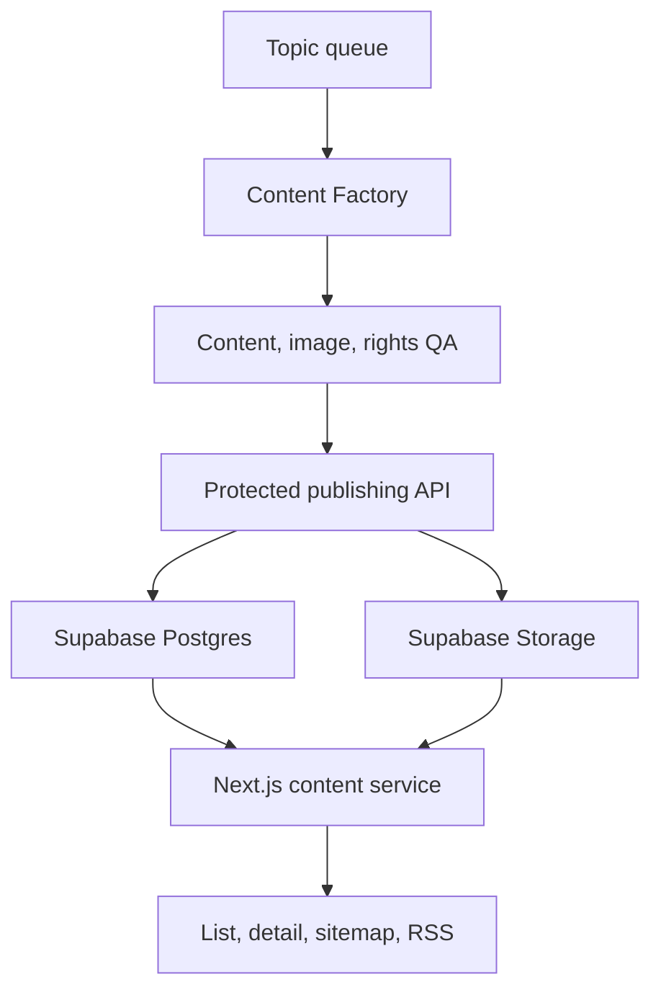
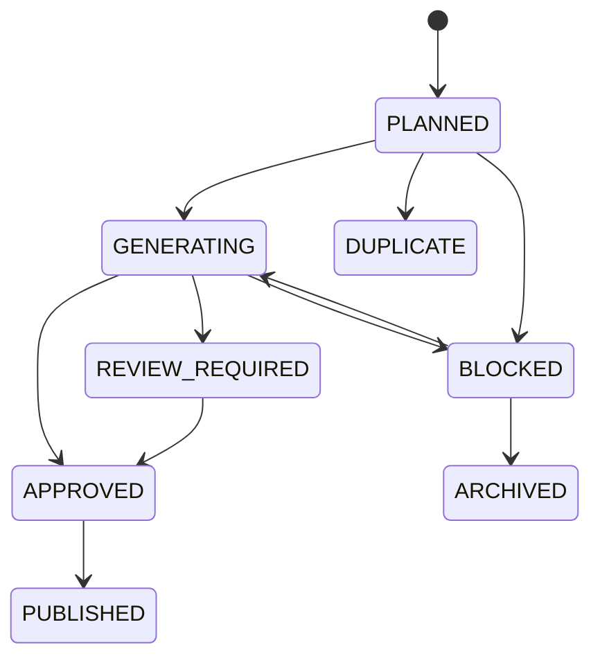

# Content Service Rebuild Guide

> Status: current implementation baseline  
> Scope: public content discovery, detail rendering, content data, images, publishing pipeline, SEO, deployment, and operations  
> Product rules: [`CONTENT.md`](./CONTENT.md)  
> Factory rules: [`../00_ai/CONTENT_FACTORY.md`](../00_ai/CONTENT_FACTORY.md)

## 1. Purpose

This document is the implementation blueprint for rebuilding the FitBike content service from an empty environment.

It does not duplicate editorial policy. `CONTENT.md` defines what the product should do, and the documents under `docs/00_ai` define how content and images are produced. This guide connects those rules to the current application, database, Storage, protected publishing API, SEO surfaces, deployment, and verification process.

A rebuild is complete only when all of the following work together:

- users can discover and read published guides;
- structured body blocks render consistently on mobile and desktop;
- images are served from FitBike Storage rather than external hotlinks;
- only approved queue items can be published through a protected boundary;
- public RLS exposes only active content whose publication time has arrived;
- sitemap, RSS, metadata, and related-content navigation include the new content;
- the Production URL, database row, Storage objects, and SEO endpoints are verified.

## 2. Source of truth and ownership

| Concern | Source of truth |
|---|---|
| Product purpose, content types, public UX | `docs/03_service_modules/CONTENT.md` |
| Factory workflow and completion criteria | `docs/00_ai/CONTENT_FACTORY.md` |
| Editorial and visual rules | `docs/00_ai/CONTENT_EDITORIAL_VISUAL_STANDARD.md` |
| Image storage and provenance | `docs/00_ai/CONTENT_IMAGE_STORAGE_POLICY.md` |
| Topic selection and duplicate handling | `docs/00_ai/CONTENT_QUEUE.md` |
| Public screen and responsive conventions | `docs/02_framework/SCREEN.md` |
| SEO and GEO conventions | `docs/02_framework/SEO_GEO.md` |
| Runtime types and validation | `src/features/content/types/content.types.ts`, `src/lib/content-factory/schemas.ts` |
| Database contract | `supabase/migrations/**` and the deployed Supabase schema |

The FitBike repository owns the public application, database migrations, Storage contract, protected publishing API, and canonical policy documents. Content producers must publish through the protected API or an equivalent server-only transaction; they must not write arbitrary Production rows from a browser or expose the service-role key.

There are currently two production surfaces to account for:

1. the in-repository runtime under `scripts/content-factory/**`, invoked by `.github/workflows/content-production-batch.yml`;
2. the separated `FitBike-Content-Factory` producer, which prepares work packages and calls the protected FitBike publishing boundary.

Do not remove either path until callers have been inventoried and one migration has been completed. Regardless of producer, the FitBike database and publishing contract remain authoritative.

## 3. System architecture



### Trust boundaries

- Browser and search crawlers use the Supabase anonymous key and public RLS only.
- Internal publishing routes require `Authorization: Bearer <CONTENT_FACTORY_PUBLISH_TOKEN>`.
- Internal routes use `SUPABASE_SECRET_KEY`, falling back to `SUPABASE_SERVICE_ROLE_KEY`, on the server only.
- The service-role key must never use the `NEXT_PUBLIC_` prefix or enter client bundles, logs, artifacts, screenshots, or generated packages.
- Publishing is transactional: the content row, relations, asset provenance, and queue transition either succeed together or fail together.

## 4. Public product behavior

### 4.1 Routes

| Route | Purpose | Cache/current behavior |
|---|---|---|
| `/contents` | Searchable and filterable guide catalogue | server data with 300-second revalidation |
| `/contents/[contentKey]` | Published guide detail | server-rendered metadata and content |
| `/shops` | Destination when professional inspection is recommended | normal service route |
| `/sitemap.xml` | Discoverable published URLs | dynamic, 300-second revalidation |
| `/rss.xml` | Up to 50 recent published guides | dynamic, 300-second CDN cache |

The home page may show the three latest guides, but the content service must not depend on that module to be discoverable.

### 4.2 Catalogue

The catalogue loads all currently published list items and provides client-side discovery:

- free-text search over title and summary;
- type filters: all, inspection/maintenance, replacement/DIY, parts specification, and model guide;
- count per type and current result count;
- reset and zero-result states;
- responsive cards with thumbnail, type, title, and summary.

Current search is intentionally simple and client-side. If the corpus becomes too large to send in one response, replace it with paginated server search while preserving the same visible behavior and canonical URLs.

### 4.3 Detail page

The detail page presents, in order:

1. breadcrumb;
2. content type and `등록일`;
3. title and summary;
4. optional hero image;
5. structured body blocks;
6. collapsed `참고 공식 자료` section;
7. one common model/year disclaimer below the references;
8. professional-inspection call to action linking to `/shops` when relevant;
9. related guides and a link back to the complete catalogue.

Do not show a modified date. Do not repeat the common model/year disclaimer throughout individual articles.

Official references are collapsed by default. Show the source name as linked text, for example `Ducati 모델 사용자 설명서`; never render a raw URL as visible copy. Links must use safe external-link behavior.

### 4.4 Body block contract

`body_blocks` is a JSON array. The current renderer accepts these blocks:

| Type | Required shape | Rendering intent |
|---|---|---|
| `heading` | `level: 2 \| 3`, `text` | semantic section title |
| `paragraph` | `text` | explanatory copy |
| `image` | `storagePath`, `alt`, optional `caption` | one informational image |
| `image_gallery` | 2–6 images, optional 2/3 columns, `grid` or `swipe` | comparable states or a short sequence |
| `bullet_list` | `items[]` | unordered checks |
| `numbered_list` | `items[]` | ordered checks |
| `step` | `title`, `body`, optional `number` | one procedure step |
| `tip` | optional `title`, `body` | useful context |
| `warning` | optional `title`, `body` | concrete risk and next action |
| `table` | `headers[]`, `rows[][]` | exact comparison or specification |

Unknown or malformed blocks must fail validation before publication and be handled defensively if old data reaches the renderer.

For a swipe gallery:

- keep visible left and right inset on mobile;
- set scroll padding so the first and snapped cards align with page content;
- use CSS scroll snap and retain accessible reading order;
- remove duplicate Storage paths before rendering;
- use a grid on larger screens when comparison is easier without swiping.

Alt and caption copy describes the object, location, state, and check point. It must not expose production-method phrases such as `생성형`, `AI 이미지`, or `교육 이미지입니다`.

### 4.5 Related guides

Show up to six published guides after the article. The current selection:

- excludes the current article;
- scores meaningful title-term overlap most highly;
- adds a smaller score for the same content type;
- fills remaining positions with recent published content;
- renders a horizontal swipe row on mobile and a two/three-column grid on larger screens.

This is a deterministic discovery heuristic, not a recommendation model. A future taxonomy or curated relation table may replace the scoring function without changing the component contract.

## 5. Data model

### 5.1 Published content

#### `12_content`

| Column | Role |
|---|---|
| `content_id` | identity primary key |
| `content_key` | unique lowercase kebab-case public slug |
| `title`, `summary` | list, detail, metadata, RSS copy |
| `content_type` | `MAINTENANCE`, `DIY`, `PARTS_GUIDE`, `MODEL_GUIDE` |
| `thumbnail_image_storage_path` | optional list/related-card image |
| `hero_image_storage_path` | optional detail hero image |
| `body_blocks` | structured JSON array |
| `is_active` | public availability switch |
| `published_at` | publication gate and ordering |
| `created_at`, `updated_at` | audit and sitemap timestamps |

Public visibility requires all of:

```sql
is_active = true
and published_at is not null
and published_at <= now()
```

Apply the same predicate in RLS, repositories, sitemap, RSS, related guides, and any home-page query. A route being deployed does not make a draft public.

### 5.2 Relations

| Table | Purpose |
|---|---|
| `13_content_bike_model` | content-to-model relation |
| `14_content_bike_model_year` | content-to-model-year relation |
| `15_content_part_link` | tyre, battery, or brake relation at category/model/product scope |

The current protected publish request accepts model IDs, model-year IDs, and only `CATEGORY` part relations. The underlying part-link table has broader scope types; adding model- or product-scoped publishing requires coordinated schema, validator, RPC, QA, and UI changes.

### 5.3 Topic queue

`16_content_topic` is the production queue and duplicate-control registry. Its contract includes:

- stable `topic_key`;
- human topic and normalized subject/action/scope;
- content type and optional part/model targeting;
- priority, automation level, risk level, and attempt count;
- customer question, primary answer, required coverage, excluded claims, target reader, and content goal;
- status, error detail, and final `content_id`.



Only the publish transaction may set `PUBLISHED` and attach `content_id`. Respect the exact transitions in `content_factory_update_topic_v1` rather than updating status ad hoc.

### 5.4 Asset provenance

`17_content_asset_source` records the asset role/key, Storage path, origin, source URLs, owner, license or permission, approval status, edits, service use, and check dates.

Allowed publication rights states are:

- `OWNED_APPROVED`;
- `LICENSED_APPROVED`;
- `PERMISSION_CONFIRMED`;
- `NOT_REQUIRED`.

Important rebuild check: the repository migration `20260905121603_content_factory_publish_api.sql` references `17_content_asset_source`, but the current migration set does not visibly create that table. Before rebuilding a blank database, export the deployed table definition and RLS policies into a new idempotent migration. Do not assume Production-only schema state will appear in a fresh environment.

## 6. Storage contract

Use the `content-assets` bucket for production content images. Store paths, not full public URLs, in content data.

```text
contents/<content-key>/thumbnail.webp
contents/<content-key>/hero.webp
contents/<content-key>/body-01.webp
contents/<content-key>/body-02.webp
...
```

Requirements:

- WebP only through the protected upload endpoint;
- maximum upload size currently 4 MB per object;
- no external image hotlinking;
- the path content key must equal the payload content key;
- no silent overwrite: an existing object is reusable only when its SHA-256 is identical;
- every displayed path must have an approved provenance entry;
- reference-only assets remain separate from production assets and are not exposed by accident.

The public URL helper resolves a Storage path at render time. If the bucket or CDN policy changes, preserve database paths and change URL resolution centrally.

## 7. Application layers

Keep the content module split into these responsibilities:

```text
src/
├─ app/
│  ├─ contents/page.tsx
│  ├─ contents/[contentKey]/page.tsx
│  ├─ api/internal/content-factory/**
│  ├─ sitemap.xml/route.ts
│  └─ rss.xml/route.ts
├─ features/content/
│  ├─ components/**
│  └─ types/content.types.ts
├─ repositories/content.repository.ts
├─ services/content.service.ts
├─ services/content-factory.service.ts
└─ lib/content-factory/schemas.ts
```

- Routes compose page data, metadata, and modules.
- Components render UI and client interactions.
- Repositories contain Supabase queries and row shapes.
- Services map rows to domain types, parse blocks, and implement related-content selection.
- Zod schemas are the runtime contract for protected producer input.
- Internal routes authenticate, validate, and delegate; they do not duplicate transaction logic.

Public repositories use RLS-compatible anonymous access. Privileged content-factory repositories are server-only.

## 8. Protected publishing API

### 8.1 Authentication

Every internal route verifies a bearer token against `CONTENT_FACTORY_PUBLISH_TOKEN` using constant-time comparison. Return an authentication error before reading or mutating privileged data.

### 8.2 Endpoints

| Method and path | Purpose |
|---|---|
| `GET /api/internal/content-factory/queue/next` | return the next `PLANNED` topic by priority and age |
| `PATCH /api/internal/content-factory/queue/[topicKey]` | make one allowed optimistic status transition |
| `POST /api/internal/content-factory/assets` | upload one validated WebP object |
| `POST /api/internal/content-factory/publish` | atomically publish one approved package |

### 8.3 Publish request

The request contains:

- `topicKey`;
- content key, title, summary, type, thumbnail path, hero path, blocks, and publication time;
- model, model-year, and part relations;
- provenance metadata for every service asset.

Validation enforces kebab-case keys, exact Storage path patterns, block sizes, approved rights, content/source path correspondence, and no publication time more than one minute in the future.

The `content_factory_publish_v1` RPC locks the topic, verifies `APPROVED`, inserts all content records and relations, and changes the topic to `PUBLISHED` in one transaction. Retrying the identical already-published topic/key returns `ALREADY_PUBLISHED`; it must not duplicate content.

The current API is a creation boundary, not a general content editor. Rebuilding must therefore define a separate audited update operation for corrections to existing content, or keep those corrections as controlled administrator/database operations. Do not weaken the publish RPC to make edits convenient.

## 9. Content production lifecycle

1. Read the next queue topic and its required/excluded coverage.
2. Compare normalized intent and existing content; mark a true duplicate instead of producing it.
3. Research claims and preserve source names and links in the package.
4. Draft blocks for the user question, starting with why the check matters and the consequence of ignoring it.
5. Use clear headings such as `점검할 때 주의할 점`; avoid vague headings and generic repeated introductions.
6. State observable conditions and the next action. Do not tell users to stop inspecting when the intended action is to avoid riding and contact a shop.
7. Plan only images that answer a distinct question. Use a swipe gallery for multiple comparable visual states.
8. Generate or collect production assets, convert to WebP, record provenance, and upload.
9. Run content, safety, visual, duplicate, rights, and package QA.
10. Transition the queue through the approved states and call the publish endpoint.
11. Verify Production DB, Storage, detail URL, list discovery, related guides, sitemap, and RSS.

The batch is successful only at `PUBLISHED_VERIFIED`. A generated file, uploaded image, successful build, or `PUBLISHED` queue state alone is insufficient.

## 10. SEO, sharing, and feeds

Each detail page must provide:

- self canonical URL;
- index/follow metadata only for a public record;
- title and description from the content record;
- Open Graph and Twitter metadata;
- `Article` JSON-LD;
- `BreadcrumbList` JSON-LD;
- publication date and appropriate image URL;
- an alternate RSS link at the site level.

The sitemap contains only publicly visible content URLs and uses `updated_at` for `lastmod`. RSS contains the newest publicly visible guides and converts supported blocks into readable feed content. Escape user-facing strings and never leak internal source metadata or credentials into feeds or structured data.

After publication, allow up to five minutes for cached catalogue, sitemap, and RSS surfaces to refresh unless an explicit revalidation mechanism is added.

## 11. Environment and deployment

### 11.1 Required configuration

| Variable/secret | Runtime | Exposure |
|---|---|---|
| `NEXT_PUBLIC_SUPABASE_URL` | app and workflow | public identifier |
| `NEXT_PUBLIC_SUPABASE_ANON_KEY` | public app | public, RLS-limited |
| `SUPABASE_SECRET_KEY` | server/internal API | secret |
| `SUPABASE_SERVICE_ROLE_KEY` | server/workflow fallback | secret |
| `CONTENT_FACTORY_PUBLISH_TOKEN` | protected API and external producer | secret |

Additional provider keys may be required by a specific producer. They belong in its secret store and are not part of the public content service contract.

### 11.2 Deployment sequence

1. Provision or select the Supabase project.
2. Apply the complete, ordered migration history to an empty test database.
3. Create and policy-test the `content-assets` bucket.
4. Configure Preview and Production environment variables separately.
5. Deploy the Next.js application to Vercel.
6. Run public smoke tests before enabling a producer.
7. Configure GitHub Actions or the separated Factory with Production secrets.
8. Publish one low-risk test topic and complete end-to-end verification.
9. Enable normal batches only after the test package reaches `PUBLISHED_VERIFIED`.

The current GitHub workflow uses Node.js 22, runs `npm ci`, invokes `scripts/content-factory/autonomous-batch.mjs`, fails on preflight/global-fatal states, and uploads evidence from `content-work` and `artifacts/content-factory`.

## 12. Rebuild procedure from an empty environment

### Phase A — foundation

- restore design tokens, layout, navigation, and shared API response utilities;
- restore the Supabase browser/server/admin clients with strict key separation;
- apply database tables, constraints, indexes, timestamps, RLS, grants, and RPCs;
- restore Storage bucket policies and the central public-URL resolver.

### Phase B — read service

- implement content domain types and defensive block parsing;
- implement published list, detail, latest, model relation, and related-guide queries;
- build the catalogue search/filter states;
- build every body block, reference disclosure, shop CTA, and related-guide module;
- verify responsive image sizing, swipe inset, keyboard navigation, and semantic headings.

### Phase C — discovery

- implement detail metadata and JSON-LD;
- implement dynamic sitemap and RSS using the public visibility predicate;
- connect recent guides on the home page and related guides on details;
- confirm canonical URLs never depend on temporary deployment domains.

### Phase D — production boundary

- implement constant-time token authentication;
- implement and test queue read/update, asset upload, and publish routes;
- add Zod validation for all producer-controlled values;
- restore security-definer RPCs with empty `search_path`, explicit schema names, revoked public execution, and service-role-only grants;
- test transaction rollback, retries, duplicate slugs, invalid transitions, invalid rights, and mismatched paths.

### Phase E — factory and operations

- restore topic candidate selection and duplicate policy;
- restore research, drafting, image briefs, asset execution, QA, packaging, and evidence retention;
- restore the batch workflow and candidate-local versus global-fatal failure handling;
- document the controlled correction path for already-published content;
- add monitoring for failed batches, stale queue items, broken Storage objects, and public HTTP failures.

## 13. Test strategy

### Unit and schema tests

- all body block variants, boundaries, and malformed input;
- queue transition matrix;
- path/key matching and provenance completeness;
- related-guide exclusion, scoring, limit, and fallback;
- raw URL and prohibited image-copy detection;
- common disclaimer/reference extraction.

### Database integration tests

- RLS hides drafts, inactive rows, and future publications;
- anonymous clients cannot execute factory RPCs;
- service role can execute only the intended transaction path;
- a failed relation or provenance insert rolls back the content insert;
- an identical retry is idempotent;
- a conflicting key or topic state is rejected.

### UI and accessibility tests

- catalogue search, type filters, reset, and empty state;
- detail registration date and absence of modified date;
- `참고 공식 자료` closed by default, named links, no visible raw URL;
- gallery first-card inset, swipe snapping, and desktop grid;
- image alt/caption policy;
- shop CTA and related-guide navigation;
- keyboard focus, heading hierarchy, table overflow, and mobile viewport behavior.

### Production acceptance

For each published content key verify:

```text
GET /contents/<content-key>                 -> 200 and correct canonical
GET /contents                              -> discoverable after cache refresh
GET /sitemap.xml                           -> URL present
GET /rss.xml                               -> present when within feed limit
12_content                                 -> active, published_at reached
16_content_topic                           -> PUBLISHED with matching content_id
content-assets/contents/<content-key>/**    -> all referenced objects exist
17_content_asset_source                    -> every displayed asset accounted for
```

Also verify the representative image, body galleries, official-reference disclosure, `/shops` link where needed, and at least one working related-content transition.

## 14. Failure handling and recovery

- Treat one bad candidate as candidate-local: preserve its work package, record the reason, block it, and continue when policy allows.
- Treat credential, schema, Storage, or protected API failure as global-fatal: stop the batch before publishing more content.
- Never repair a partial publish with disconnected manual inserts. The transaction should leave no partial record; diagnose and retry after correcting the cause.
- To remove unsafe public content quickly, set `is_active = false` through an authorized audited operation. Preserve the row and evidence for review.
- Do not delete Storage objects until all database references and rollback requirements have been checked.
- A Vercel rollback restores application code, not Supabase data. Database/content rollback is a separate controlled operation.

## 15. Current limitations and required hardening

These are current implementation facts, not target-state recommendations:

1. The repository migration history needs an explicit creation/RLS migration for `17_content_asset_source` before a clean rebuild is reliable.
2. The protected publish API creates content but does not provide a general audited update API for published corrections.
3. Part relations accepted by the API are category-only although the table supports more scopes.
4. Catalogue search sends the published list to the client and searches only title and summary.
5. Related guides use title-term/type heuristics rather than curated semantic relations.
6. Catalogue, sitemap, and RSS changes may take up to five minutes to appear.
7. In-repository and separated Factory execution paths coexist and require an explicit consolidation decision.
8. The detail route currently treats `MODEL_GUIDE` hero presentation differently; confirm the desired model-first visual behavior before rebuilding it unchanged.

Resolve these deliberately. Do not silently convert a current workaround into a permanent contract.

## 16. Definition of done

The rebuilt service is ready when:

- an empty environment can be provisioned solely from versioned migrations and documented Storage setup;
- public users can search, filter, read, swipe, follow official references, find a shop, and continue to related guides;
- drafts and future/inactive content are inaccessible through pages, queries, sitemap, and RSS;
- a producer can move one low-risk topic from `PLANNED` to `PUBLISHED_VERIFIED` without direct database intervention;
- every production image has an approved provenance record and no external hotlink;
- invalid states, rights, paths, payloads, and credentials fail safely;
- automated tests and the Production acceptance checklist pass;
- operational owners can block unsafe content, diagnose a failed batch, and recover without destructive ad hoc commands.

When implementation and this document differ, first determine whether the code changed intentionally. Update the canonical product policy if behavior changed, update this rebuild guide for implementation detail, and add or amend migrations and tests so a clean environment reproduces Production.
