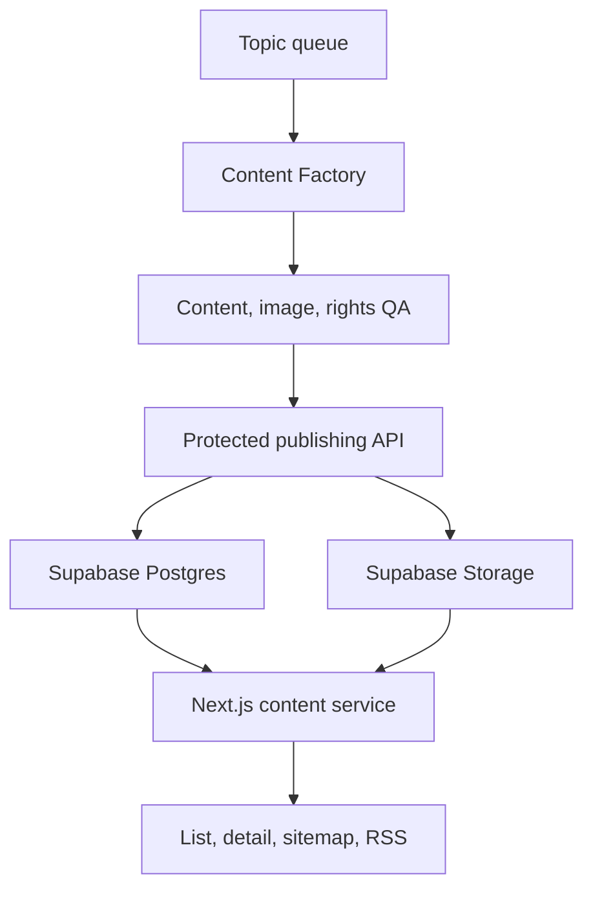
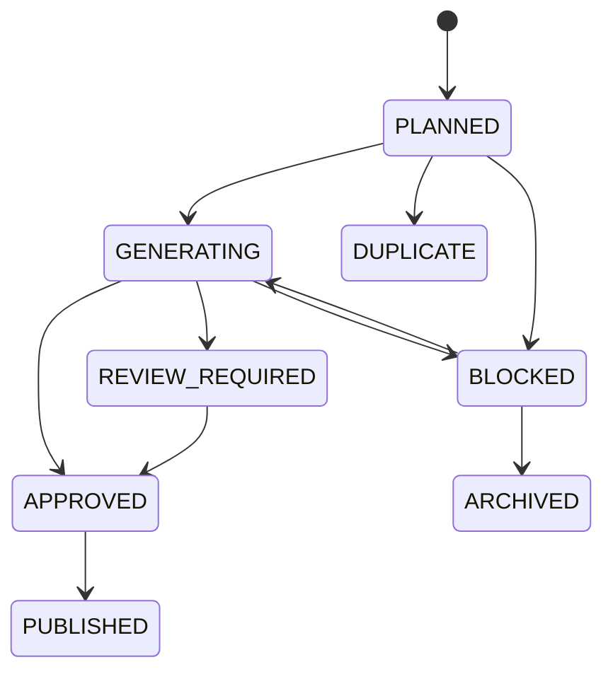

# Content Service Rebuild Guide

> Status: current implementation baseline  
> Scope: public content discovery, detail rendering, content data, images, publishing pipeline, SEO, deployment, and operations  
> Product rules: [`CONTENT.md`](./CONTENT.md)  
> Factory rules: [`../00_ai/CONTENT_FACTORY.md`](../00_ai/CONTENT_FACTORY.md)

## 1. Purpose

This document is the implementation blueprint for rebuilding the FitBike content service from an empty environment.

It does not duplicate editorial policy. `CONTENT.md` defines what the product should do, and the documents under `docs/00_ai` define how content and images are produced. This guide connects those rules to the current application, database, Storage, protected publishing API, SEO surfaces, deployment, and verification process.

A rebuild is complete only when all of the following work together:

- users can discover and read published guides;
- structured body blocks render consistently on mobile and desktop;
- images are served from FitBike Storage rather than external hotlinks;
- only approved queue items can be published through a protected boundary;
- public RLS exposes only active content whose publication time has arrived;
- sitemap, RSS, metadata, and related-content navigation include the new content;
- the Production URL, database row, Storage objects, and SEO endpoints are verified.

## 2. Source of truth and ownership

| Concern | Source of truth |
|---|---|
| Product purpose, content types, public UX | `docs/03_service_modules/CONTENT.md` |
| Factory workflow and completion criteria | `docs/00_ai/CONTENT_FACTORY.md` |
| Editorial and visual rules | `docs/00_ai/CONTENT_EDITORIAL_VISUAL_STANDARD.md` |
| Image storage and provenance | `docs/00_ai/CONTENT_IMAGE_STORAGE_POLICY.md` |
| Topic selection and duplicate handling | `docs/00_ai/CONTENT_QUEUE.md` |
| Public screen and responsive conventions | `docs/02_framework/SCREEN.md` |
| SEO and GEO conventions | `docs/02_framework/SEO_GEO.md` |
| Runtime types and validation | `src/features/content/types/content.types.ts`, `src/lib/content-factory/schemas.ts` |
| Database contract | `supabase/migrations/**` and the deployed Supabase schema |

The FitBike repository owns the public application, database migrations, Storage contract, protected publishing API, and canonical policy documents. Content producers must publish through the protected API or an equivalent server-only transaction; they must not write arbitrary Production rows from a browser or expose the service-role key.

### 2.1 How to use this as a single document

This guide is the **single rebuild entry point**. A person rebuilding the service must be able to use this file alone to understand the product, content, image, data, publishing, and operations contracts.

The linked policy files remain detailed maintenance sources. Their role is to explain or test a specific area; they are not prerequisites for understanding the rebuild. Apply this precedence when documents or code disagree:

1. user-approved product direction and `CONTENT.md`;
2. this rebuild guide as the complete service contract;
3. specialist policies under `docs/00_ai`;
4. runtime schemas, migrations, and automated QA;
5. individual work-package prompts.

A persistent rule must not exist only in a chat, prompt, or one content package. Update the appropriate specialist policy and this consolidated section together. Runtime validation and tests must then be aligned with the documentation.

### 2.2 Product foundation

FitBike content answers real motorcycle maintenance, inspection, DIY, parts-understanding, and model questions. Its first goal is to resolve the user's question inside the article—not to force a product page visit, rank products, or manufacture search traffic.

Every topic starts with:

- the question the user is actually asking;
- why the information matters;
- what may happen if the condition is ignored;
- what the user can safely observe or do;
- what state requires adjustment, repair, avoiding a ride, or professional inspection;
- what is different by model/year and where the official criterion is found.

Do not create a topic merely because FitBike has a model-to-part relation. Do not mass-produce `model + part specification` pages from Fitment data. A model-specific article requires independent user value and official manufacturer evidence.

The product is information-first. Recommendations, popularity rankings, unsupported superlatives, fear-based wording, and forced purchase CTAs are prohibited. Model, part, shop, or product links appear only when they help the next action.

### 2.3 Content planning contract

Before research or writing, define:

- `customer_question` and `primary_answer`;
- target reader and assumed knowledge;
- content type and purpose template;
- required coverage and excluded claims;
- critical facts and safety risk;
- existing-content intent overlap;
- model/year scope;
- information better explained by a visual.

Use one of these purpose templates:

| Template | User purpose | Required result |
|---|---|---|
| `CHECK` | judge condition or replacement need | observable normal/attention/professional-check states and next action |
| `HOW_TO` | perform a task | preparation, access, steps, completion check, and professional handoff |
| `TROUBLESHOOT` | investigate a symptom | cause branches and action per result |
| `SPEC` | read a specification or marking | code meaning, actual-bike comparison, pre-purchase check |
| `MODEL_DATA` | find model/year data | short officially supported data table |
| `EXPLAIN` | understand a principle | plain definition, real context, misconception prevention |
| `COMPARE` | understand differences | neutral comparison and applicable conditions, never a ranking |
| `PREVENT` | prevent a problem | do, avoid, observe, and respond |
| `CHECKLIST` | make a quick situational check | concise checks and next action |

Length follows the question, not a quota. Do not pad a short answer with generic sections. A long procedure should contain only the detail needed to perform or hand off the task safely.

#### Topic discovery sources

Candidate topics must come from a demonstrated user need or an intentional coverage gap. Acceptable inputs are:

- questions explicitly asked by FitBike users;
- internal site-search terms and zero-result searches;
- Search Console queries and pages with a clear unanswered intent;
- recurring questions from maintenance, owner, or model communities, used as discovery rather than factual evidence;
- manufacturer manual structure, service notices, or model changes that users need explained;
- gaps found while reviewing an existing article, such as a necessary follow-up question that would make that article too broad;
- seasonal or ownership moments such as long-term storage, first ride after storage, rain, washing, or used-bike handover;
- support or shop questions that can be answered safely without diagnosing an individual motorcycle.

The following are not sufficient reasons by themselves:

- a keyword has high volume;
- a FitBike table contains a model/part relation;
- a competitor has an article;
- a new title can be generated from an existing title;
- an available image needs somewhere to be used;
- a content-type quota is short.

When analytics are unavailable, record the topic as a hypothesis and state the observed question/source that motivated it. Do not invent demand numbers.

#### Candidate record required before queue registration

Every candidate must contain enough information to judge value and duplication before writing:

| Field | Decision supported |
|---|---|
| `topic_key` | stable tracking and idempotency |
| `working_title` | understandable editorial label, not the final SEO title |
| `customer_question` | the exact question in the reader's language |
| `primary_answer` | one- or two-sentence direct answer |
| `target_reader` | experience, situation, and motorcycle context |
| `content_goal` | decision or action the reader can complete |
| `normalized_subject` | component or concept being discussed |
| `normalized_action` | inspect, maintain, replace, select, understand, compare, or troubleshoot |
| `normalized_scope` | generic, model, model-year, product, or situation |
| `content_type`, `content_template` | composition contract |
| `required_coverage` | questions that must be answered |
| `excluded_claims` | claims or procedures that must not be generalized |
| `critical_facts` | facts requiring stronger evidence |
| `risk_level` | automation and review boundary |
| `evidence_feasibility` | whether adequate sources appear obtainable |
| `visual_need` | whether a visual is essential, useful, or unnecessary |
| `discovery_basis` | where the user need was observed |
| `duplicate_candidates` | closest existing topics/content and initial distinction |

Do not register a title-only row as ready for production. If the current schema cannot store a field, preserve it in the candidate artifact until a reviewed schema change is made.

#### Topic eligibility gate

A candidate enters `PLANNED` only when all answers are yes:

1. Is there one clear primary question?
2. Can the article provide a useful answer inside FitBike without a forced product click?
3. Is the intended result observable or actionable by the target reader?
4. Can safety-critical or model-specific claims be supported adequately?
5. Is its independent value not already satisfied by an existing or queued article?
6. Is the scope narrow enough for one coherent article but large enough to justify its own URL?
7. Can the content avoid diagnosis, unsupported specification, recommendation, ranking, or sales framing?
8. Is the proposed article better than simply updating an existing article?

If evidence is not yet known, the candidate may remain a research backlog item; it must not be treated as publish-ready.

#### Priority selection

Queue priority is based on user value, not production convenience:

| Priority | Use when |
|---:|---|
| `1` | recurring/high-consequence user question, material safety misunderstanding, broken or missing ownership guidance, or a necessary correction |
| `2` | broadly useful maintenance/DIY/parts question with clear evidence and independent intent |
| `3` | narrow long-tail, seasonal, optional explanatory, or evidence/visual work that can wait |

Within the same priority, process older approved candidates first. A newer candidate may move ahead only when its user impact or correction urgency is documented. Balance the portfolio across ownership moments and content types; do not publish a run of nearly identical component checks simply because they are easy to automate.

#### Duplicate and cannibalization decision

Duplicate review must compare the candidate against:

- all published content, including inactive content that could be restored;
- every non-archived queue topic, not only `PLANNED`;
- blocked/review-required work and saved work packages;
- legacy URLs, redirects, and canonical destinations;
- model and model-year relations;
- title, summary, headings, tables, lists, and the primary answer—not title alone.

Normalize and compare these dimensions:

1. user question;
2. subject/component;
3. requested action or decision;
4. scope: generic, situation, model, model-year, or product;
5. target reader and ownership moment;
6. primary answer and expected next action;
7. required coverage and evidence;
8. search-result promise expressed by title and summary.

Use semantic similarity only to create a review shortlist. A token-overlap score must never be the sole publish decision, especially for Korean compound terms and differently worded questions.

| Classification | Meaning | Required action |
|---|---|---|
| `EXACT_EXISTING` | same question, answer, scope, and result already exist | link queue to existing content; do not create |
| `INTENT_DUPLICATE` | wording differs but the user would receive substantially the same answer | mark duplicate or merge into existing content |
| `UPDATE_EXISTING` | the candidate mainly supplies missing coverage, fresher facts, or better images | revise the existing canonical article; do not add a URL |
| `CONSOLIDATE` | two weak/overlapping articles should become one complete answer | choose one canonical, merge value, redirect/deactivate safely |
| `OVERLAP_BUT_DISTINCT` | same subject but a different decision, situation, scope, or next action | create only after writing the distinction statement |
| `MODEL_VARIANT` | generic guidance exists but official model/year structure materially changes the answer | create a model article and cross-link it |
| `NEW` | no current article resolves the primary question | create normally |
| `HOLD_SCOPE` | distinction cannot be explained clearly | hold and redefine before research |

The required distinction statement is:

```text
Existing content answers: <question/result>.
This candidate answers: <different question/result>.
The user needs a separate page because: <scope, evidence, or next-action difference>.
```

If that statement cannot be written without relying on wording alone, the candidate is not independent.

Examples:

- `브레이크 패드 마모 확인` versus `브레이크 패드 교체 시기`: usually one inspection intent; update/merge rather than create two pages.
- `브레이크 패드 마모 확인` versus `브레이크 패드 구매 전 규격 확인`: same component, different decision and evidence; separate pages may be valid.
- `오토바이 시트 잠금장치 확인` versus `특정 모델 시트 여는 방법`: separate only when an official model-specific mechanism or access sequence materially changes the answer.
- `타이어 공기압 확인` versus `장기 보관 후 첫 주행 점검`: overlapping check, but the second may be a distinct situational checklist if it provides a broader decision flow.

Run the duplicate gate at four moments: candidate registration, production selection, after the outline/primary answer is written, and immediately before publication. Subject drift during research can turn a previously distinct topic into a duplicate.

#### New article versus existing article decision

Prefer updating an existing article when the candidate adds a missing section, replaces weak images, corrects a fact, improves wording, or adds one model example without changing the primary question. Create a new article when the reader, decision, evidence set, or next action is materially different and each page can be summarized without repeating the other.

When consolidating, preserve the stronger canonical URL, merge unique value, update relations and internal links, and redirect or deactivate the weaker URL according to SEO policy. Never leave two active near-identical pages merely to preserve content count.

#### Content composition blueprint

Build the outline from the question rather than using one universal article skeleton. The default information flow is:

1. **Reason** — why the reader should care and what may worsen if ignored;
2. **Direct answer** — the short decision or principle;
3. **Scope** — what can be seen/done safely and what varies by model;
4. **Locate/access** — where the target is and how much removal is involved;
5. **Observe/perform** — distinct checks or steps, supported by visuals where useful;
6. **Interpret** — what the observed states mean without pretending to diagnose;
7. **Act** — continue monitoring, maintain, avoid riding, or contact a shop;
8. **Official references** — one final collapsed source group and the common model/year notice;
9. **Continue discovery** — shop CTA when relevant and related guides.

Template-specific emphasis:

| Template | Composition emphasis |
|---|---|
| `CHECK` | why it matters → visible scope → inspection points → state comparison → next action |
| `HOW_TO` | suitability/safety → tools → location/access → ordered steps → restoration → result check |
| `TROUBLESHOOT` | symptom definition → simple checks → branching table → action per result → limit of self-check |
| `SPEC` | where marking is found → how to read it → official/actual-bike comparison → purchase check |
| `MODEL_DATA` | exact model/year scope → concise official facts → verification location → variant warning |
| `COMPARE` | comparison conditions → neutral table → practical difference → applicable context, no winner |
| `PREVENT` | risk/context → preventive actions → avoid list → warning signs → follow-up timing |
| `CHECKLIST` | situation → short ordered checklist → go/attention/professional action |

Each section must contribute a new answer, observation, distinction, or action. Remove a section when deleting it does not reduce the user's ability to decide or act. Images and tables replace repetitive prose; they do not create an obligation to restate the same information below them.

Before approval, create a coverage map linking every `required_coverage` item to at least one body block and every visual to one user question. Also record where each critical fact is used. This prevents a polished article from omitting the original question.

### 2.4 Research and evidence constraints

Use evidence in this order:

1. manufacturer or brand official page;
2. owner's manual, service manual, or official technical document;
3. reliable technical and maintenance reference;
4. specialist publication or documented real-world work;
5. blog/community material only for access context, recurring questions, and discovery.

Model-specific specifications, limits, intervals, torque values, pressures, capacities, warnings, and safety-critical claims require official evidence. A blog, marketplace listing, generated answer, or FitBike Fitment row cannot independently establish those facts. If official evidence is absent or conflicting, omit the claim or hold the content.

The internal fact register preserves each claim, source URL, source type, verification state, critical flag, and checked date. The public article shows sources only in the final collapsed `참고 공식 자료` section. Render the source name as the link text; never show a raw URL. Do not invent a missing URL.

### 2.5 Writing constraints

- Start with the reader's motive: why this check matters and the realistic consequence of ignoring it.
- Give the core answer early, followed by judgment criteria, inspection/action, and the next step.
- Use concrete titles such as `점검할 때 놓치기 쉬운 부분` or `정비소를 찾아야 하는 경우`.
- Do not use vague headings such as `한 부분만 보고 판단하지 않는 이유` when the intended action can be named.
- Do not repeat the summary in the first paragraph or restate one fact across prose, list, table, and image.
- Explain technical terms at the point of use so a beginner can act.
- Distinguish no-disassembly observation, cover access, multiple-part removal, and official-procedure/professional work.
- For `HOW_TO`, cover location, access, interference, model differences, safe handoff, and restoration/completion checks.
- For `CHECK`, distinguish what is directly visible, what requires access, and what requires professional assessment.
- Keep the common model/year disclaimer once below `참고 공식 자료`, not in every introduction.
- Do not expose internal words such as `STOP`, `HOLD`, `BLOCKED`, or Factory error codes.

User-facing safety copy follows `observation → meaning → next action`:

- normal uncertainty: `추가 확인` or a specific re-check;
- maintenance need: `조정·정비 필요`;
- outside user scope: `직접 분해하지 말고 전문 점검으로 전환`;
- professional assessment: state the symptom, riding decision, and `/shops` action;
- verified immediate riding risk only: `이 상태에서는 운행하지 마세요`, with the reason.

Do not say `점검을 중단` when the inspection itself is not hazardous. The user came to inspect; the correct outcome is usually to avoid riding, avoid further disassembly, or contact a shop.

### 2.6 Image purpose and quantity

An image is an information block, not decoration. Every image must clearly answer at least one question:

- Where is the inspection point?
- What exactly should be checked?
- What condition is normal or problematic?
- Where is the tool or measurement contact point?
- What is the next safe action or completed state?

There is no fixed image count. Use no image when it adds no information, and use multiple distinct images when location, access, state comparison, or sequence cannot be understood from one. Never add generic images to satisfy a quota.

Use these roles: `HERO`, `LOCATION`, `ACCESS`, `IDENTIFY`, `NORMAL_ABNORMAL`, `ACTION`, `SEQUENCE`, `MEASUREMENT`, `RESULT`, `WARNING`, and `CONCEPT`. Hero and body images must not duplicate one another. The same production asset must not repeat inside an article.

Multiple comparable states may use `image_gallery` with mobile swipe. Each slide still has one purpose. Do not compose a dashboard, presentation, multi-topic collage, or several tiny panels into a single production image.

### 2.7 Mandatory image brief

Create one independent brief before finding, editing, or generating each production image:

```yaml
content_key: motorcycle-example
image_id: brake-surface-groove-01
asset_role: BODY
visual_role: NORMAL_ABNORMAL
user_question: "이 홈은 정비소 확인이 필요한 상태인가?"
inspection_target: brake disc surface
inspection_point: groove continuity and local depth difference
information_goal: distinguish light wear marks from a deep continuous groove
source_strategy: REAL_ASSET_FIRST
real_photo_required: true
generation_allowed: CONCEPT_ONLY
human_presence: NONE
must_show:
  - one clearly visible disc surface
  - groove inspection area at mobile scale
prohibited:
  - fictional measurement
  - brand mark or watermark
  - multiple comparison panels
mobile_requirement: core condition identifiable at 390px
fact_dependencies:
  - verified manufacturer inspection guidance
production_output: one 4:3 body asset
```

The invariant is `1 brief = 1 acquisition/generation = 1 production asset`. Do not silently change `must_show`, prohibited details, geometry, model identity, or fact dependencies during generation.

### 2.8 Image source, rights, and editing constraints

Choose image sources in this order when suitable:

1. approved direct FitBike photography;
2. reusable/licensed real-world image with recorded permission;
3. approved official manufacturer asset;
4. approved brand asset—prefer available MAXXIS assets for tyres and POWEROAD assets for batteries;
5. a newly created FitBike educational visual;
6. no visual or image review required.

Physical location, model identity, product label, wiring, access sequence, wear, damage, corrosion, leakage, and other factual states are real-image-first. A generated visual is better suited to a principle, measurement concept, decision flow, or simplified sequence. Never present a generated scene as proof of a specific real model, product, failure, or damage state.

Public availability does not grant reuse rights. Record source name/URL, owner, license or permission, rights status, edit history, content use, and last check. Do not publish an asset whose provenance is missing or unapproved.

Watermarked, stock-preview, third-party-logo, or copyright-marked images are not production sources. Do not remove, cover, blur, or crop out a watermark. They may be research references only; find a clean permitted source or create an independent visual from verified facts.

Allowed factual edits include mobile crop, rotation/perspective correction, exposure/white balance/sharpness correction, privacy masking, non-obscuring outline/arrow/short label, and format optimization. Prohibited edits include changing product codes, terminal direction, model identity, part position, actual wear/damage, or combining different scenes as one factual photograph.

### 2.9 People, text, and branding in images

The default is `human_presence: NONE`. Use `HANDS_ONLY` only when hand/tool position or contact direction cannot be explained otherwise. Use `PERSON_REQUIRED` only when full posture or riding position is the information. When a person is necessary, use an adult who fits the Korean service context naturally; avoid stereotypes, unsafe clothing, jewellery, exposed skin, and a face or fashion treatment that overwhelms the motorcycle.

Image text defaults to none. A short label, simple number, arrow, or necessary annotation is allowed only when HTML cannot communicate the visual relationship as clearly. Never put headlines, body copy, promotional chips, unsupported values, logos, brand marks, product numbers, or watermarks into a generated visual.

At a 390px viewport, the subject and any necessary label must remain identifiable. As a starting point for a 1200px source, use roughly 49px or larger for ordinary annotations, 55px or larger for key labels, and 68px or larger for a rare title. If copy does not fit, split the image or move it to HTML rather than shrinking it.

Public alt text uses `object + location/action + inspection point`. Captions add the visible check or next action without repeating the body. Never use `생성형`, `생성 이미지`, `AI 이미지`, `AI로 생성`, `인공지능 생성`, `교육 이미지입니다`, `교육용 이미지입니다`, or `비교 이미지입니다` in alt text, captions, or other visible image copy. Production method belongs only in provenance metadata.

### 2.10 Production image specification

| Asset | Default dimensions | Ratio | Format |
|---|---:|---:|---|
| Thumbnail | 1200 × 675 | 16:9 | WebP, sRGB |
| Hero | 1600 × 900 | 16:9 | WebP, sRGB |
| Body | 1200 × 900 | 4:3 | WebP, sRGB |

Body images generally target 100–300 KB when legibility is preserved. The protected upload limit is 4 MB. Only an LCP/hero candidate may load eagerly; body images load lazily and declare responsive sizes. Production delivery must use `content-assets` Storage. External hotlinks, repository `/public` delivery, and `editorial-reference/**` paths are prohibited.

Reference dashboards, collages, UI mockups, and discarded generations form a visual knowledge base only. Never crop a small panel from a reference dashboard and serve it as a production photograph. Derive a new single-purpose brief and create a new production asset.

### 2.11 Consolidated publication gates

Content cannot newly enter `PUBLISHED` when any critical gate fails:

- the article does not answer the customer question;
- the intent duplicates an existing article without independent value;
- a required or safety-critical claim lacks evidence or conflicts with another source;
- model-specific facts are not officially verified;
- the procedure omits access, restoration, or professional handoff information;
- safety language does not match the observed risk and next action;
- references use inconsistent headings or expose raw URLs;
- a block is invalid, empty, or unsupported;
- a displayed image lacks alt/caption, provenance, approved rights, or a Storage object;
- an image is duplicated, generic to the wrong target, misleading, watermarked, factually distorted, or unreadable on mobile;
- an external, local-public, or reference-library path is used for production;
- the queue state, content type, slug, relation, publication time, or asset path violates the publishing contract.

Machine QA checks schemas, required fields, paths, hashes, dimensions, file format, source records, reference formatting, duplicate keys, and HTTP/Storage existence. Editorial/AI QA judges answer quality, practical usefulness, evidence sufficiency, safety meaning, reality match, readability, visual value, redundancy, and intent uniqueness. A numeric score never overrides a critical failure.

If a weakness can be repaired safely, research, rewrite, find a different source, revise the brief, or regenerate within the same job. Hold only when evidence, safety conditions, model reality, rights, or schema conflicts cannot be resolved. Preserve `failed_stage`, reason, attempts, and next action.

There are currently two production surfaces to account for:

1. the in-repository runtime under `scripts/content-factory/**`, invoked by `.github/workflows/content-production-batch.yml`;
2. the separated `FitBike-Content-Factory` producer, which prepares work packages and calls the protected FitBike publishing boundary.

Do not remove either path until callers have been inventoried and one migration has been completed. Regardless of producer, the FitBike database and publishing contract remain authoritative.

## 3. System architecture



### Trust boundaries

- Browser and search crawlers use the Supabase anonymous key and public RLS only.
- Internal publishing routes require `Authorization: Bearer <CONTENT_FACTORY_PUBLISH_TOKEN>`.
- Internal routes use `SUPABASE_SECRET_KEY`, falling back to `SUPABASE_SERVICE_ROLE_KEY`, on the server only.
- The service-role key must never use the `NEXT_PUBLIC_` prefix or enter client bundles, logs, artifacts, screenshots, or generated packages.
- Publishing is transactional: the content row, relations, asset provenance, and queue transition either succeed together or fail together.

## 4. Public product behavior

### 4.1 Routes

| Route | Purpose | Cache/current behavior |
|---|---|---|
| `/contents` | Searchable and filterable guide catalogue | server data with 300-second revalidation |
| `/contents/[contentKey]` | Published guide detail | server-rendered metadata and content |
| `/shops` | Destination when professional inspection is recommended | normal service route |
| `/sitemap.xml` | Discoverable published URLs | dynamic, 300-second revalidation |
| `/rss.xml` | Up to 50 recent published guides | dynamic, 300-second CDN cache |

The home page may show the three latest guides, but the content service must not depend on that module to be discoverable.

### 4.2 Catalogue

The catalogue loads all currently published list items and provides client-side discovery:

- free-text search over title and summary;
- type filters: all, inspection/maintenance, replacement/DIY, parts specification, and model guide;
- count per type and current result count;
- reset and zero-result states;
- responsive cards with thumbnail, type, title, and summary.

Current search is intentionally simple and client-side. If the corpus becomes too large to send in one response, replace it with paginated server search while preserving the same visible behavior and canonical URLs.

### 4.3 Detail page

The detail page presents, in order:

1. breadcrumb;
2. content type and `등록일`;
3. title and summary;
4. optional hero image;
5. structured body blocks;
6. collapsed `참고 공식 자료` section;
7. one common model/year disclaimer below the references;
8. professional-inspection call to action linking to `/shops` when relevant;
9. related guides and a link back to the complete catalogue.

Do not show a modified date. Do not repeat the common model/year disclaimer throughout individual articles.

Official references are collapsed by default. Show the source name as linked text, for example `Ducati 모델 사용자 설명서`; never render a raw URL as visible copy. Links must use safe external-link behavior.

### 4.4 Body block contract

`body_blocks` is a JSON array. The current renderer accepts these blocks:

| Type | Required shape | Rendering intent |
|---|---|---|
| `heading` | `level: 2 \| 3`, `text` | semantic section title |
| `paragraph` | `text` | explanatory copy |
| `image` | `storagePath`, `alt`, optional `caption` | one informational image |
| `image_gallery` | 2–6 images, optional 2/3 columns, `grid` or `swipe` | comparable states or a short sequence |
| `bullet_list` | `items[]` | unordered checks |
| `numbered_list` | `items[]` | ordered checks |
| `step` | `title`, `body`, optional `number` | one procedure step |
| `tip` | optional `title`, `body` | useful context |
| `warning` | optional `title`, `body` | concrete risk and next action |
| `table` | `headers[]`, `rows[][]` | exact comparison or specification |

Unknown or malformed blocks must fail validation before publication and be handled defensively if old data reaches the renderer.

For a swipe gallery:

- keep visible left and right inset on mobile;
- set scroll padding so the first and snapped cards align with page content;
- use CSS scroll snap and retain accessible reading order;
- remove duplicate Storage paths before rendering;
- use a grid on larger screens when comparison is easier without swiping.

Alt and caption copy describes the object, location, state, and check point. It must not expose production-method phrases such as `생성형`, `AI 이미지`, or `교육 이미지입니다`.

### 4.5 Related guides

Show up to six published guides after the article. The current selection:

- excludes the current article;
- scores meaningful title-term overlap most highly;
- adds a smaller score for the same content type;
- fills remaining positions with recent published content;
- renders a horizontal swipe row on mobile and a two/three-column grid on larger screens.

This is a deterministic discovery heuristic, not a recommendation model. A future taxonomy or curated relation table may replace the scoring function without changing the component contract.

## 5. Data model

### 5.1 Published content

#### `12_content`

| Column | Role |
|---|---|
| `content_id` | identity primary key |
| `content_key` | unique lowercase kebab-case public slug |
| `title`, `summary` | list, detail, metadata, RSS copy |
| `content_type` | `MAINTENANCE`, `DIY`, `PARTS_GUIDE`, `MODEL_GUIDE` |
| `thumbnail_image_storage_path` | optional list/related-card image |
| `hero_image_storage_path` | optional detail hero image |
| `body_blocks` | structured JSON array |
| `is_active` | public availability switch |
| `published_at` | publication gate and ordering |
| `created_at`, `updated_at` | audit and sitemap timestamps |

Public visibility requires all of:

```sql
is_active = true
and published_at is not null
and published_at <= now()
```

Apply the same predicate in RLS, repositories, sitemap, RSS, related guides, and any home-page query. A route being deployed does not make a draft public.

### 5.2 Relations

| Table | Purpose |
|---|---|
| `13_content_bike_model` | content-to-model relation |
| `14_content_bike_model_year` | content-to-model-year relation |
| `15_content_part_link` | tyre, battery, or brake relation at category/model/product scope |

The current protected publish request accepts model IDs, model-year IDs, and only `CATEGORY` part relations. The underlying part-link table has broader scope types; adding model- or product-scoped publishing requires coordinated schema, validator, RPC, QA, and UI changes.

### 5.3 Topic queue

`16_content_topic` is the production queue and duplicate-control registry. Its contract includes:

- stable `topic_key`;
- human topic and normalized subject/action/scope;
- content type and optional part/model targeting;
- priority, automation level, risk level, and attempt count;
- customer question, primary answer, required coverage, excluded claims, target reader, and content goal;
- status, error detail, and final `content_id`.



Only the publish transaction may set `PUBLISHED` and attach `content_id`. Respect the exact transitions in `content_factory_update_topic_v1` rather than updating status ad hoc.

### 5.4 Asset provenance

`17_content_asset_source` records the asset role/key, Storage path, origin, source URLs, owner, license or permission, approval status, edits, service use, and check dates.

Allowed publication rights states are:

- `OWNED_APPROVED`;
- `LICENSED_APPROVED`;
- `PERMISSION_CONFIRMED`;
- `NOT_REQUIRED`.

Important rebuild check: the repository migration `20260905121603_content_factory_publish_api.sql` references `17_content_asset_source`, but the current migration set does not visibly create that table. Before rebuilding a blank database, export the deployed table definition and RLS policies into a new idempotent migration. Do not assume Production-only schema state will appear in a fresh environment.

## 6. Storage contract

Use the `content-assets` bucket for production content images. Store paths, not full public URLs, in content data.

```text
contents/<content-key>/thumbnail.webp
contents/<content-key>/hero.webp
contents/<content-key>/body-01.webp
contents/<content-key>/body-02.webp
...
```

Requirements:

- WebP only through the protected upload endpoint;
- maximum upload size currently 4 MB per object;
- no external image hotlinking;
- the path content key must equal the payload content key;
- no silent overwrite: an existing object is reusable only when its SHA-256 is identical;
- every displayed path must have an approved provenance entry;
- reference-only assets remain separate from production assets and are not exposed by accident.

The public URL helper resolves a Storage path at render time. If the bucket or CDN policy changes, preserve database paths and change URL resolution centrally.

## 7. Application layers

Keep the content module split into these responsibilities:

```text
src/
├─ app/
│  ├─ contents/page.tsx
│  ├─ contents/[contentKey]/page.tsx
│  ├─ api/internal/content-factory/**
│  ├─ sitemap.xml/route.ts
│  └─ rss.xml/route.ts
├─ features/content/
│  ├─ components/**
│  └─ types/content.types.ts
├─ repositories/content.repository.ts
├─ services/content.service.ts
├─ services/content-factory.service.ts
└─ lib/content-factory/schemas.ts
```

- Routes compose page data, metadata, and modules.
- Components render UI and client interactions.
- Repositories contain Supabase queries and row shapes.
- Services map rows to domain types, parse blocks, and implement related-content selection.
- Zod schemas are the runtime contract for protected producer input.
- Internal routes authenticate, validate, and delegate; they do not duplicate transaction logic.

Public repositories use RLS-compatible anonymous access. Privileged content-factory repositories are server-only.

## 8. Protected publishing API

### 8.1 Authentication

Every internal route verifies a bearer token against `CONTENT_FACTORY_PUBLISH_TOKEN` using constant-time comparison. Return an authentication error before reading or mutating privileged data.

### 8.2 Endpoints

| Method and path | Purpose |
|---|---|
| `GET /api/internal/content-factory/queue/next` | return the next `PLANNED` topic by priority and age |
| `PATCH /api/internal/content-factory/queue/[topicKey]` | make one allowed optimistic status transition |
| `POST /api/internal/content-factory/assets` | upload one validated WebP object |
| `POST /api/internal/content-factory/publish` | atomically publish one approved package |

### 8.3 Publish request

The request contains:

- `topicKey`;
- content key, title, summary, type, thumbnail path, hero path, blocks, and publication time;
- model, model-year, and part relations;
- provenance metadata for every service asset.

Validation enforces kebab-case keys, exact Storage path patterns, block sizes, approved rights, content/source path correspondence, and no publication time more than one minute in the future.

The `content_factory_publish_v1` RPC locks the topic, verifies `APPROVED`, inserts all content records and relations, and changes the topic to `PUBLISHED` in one transaction. Retrying the identical already-published topic/key returns `ALREADY_PUBLISHED`; it must not duplicate content.

The current API is a creation boundary, not a general content editor. Rebuilding must therefore define a separate audited update operation for corrections to existing content, or keep those corrections as controlled administrator/database operations. Do not weaken the publish RPC to make edits convenient.

## 9. Content production lifecycle

1. Read the next queue topic and its required/excluded coverage.
2. Compare normalized intent and existing content; mark a true duplicate instead of producing it.
3. Research claims and preserve source names and links in the package.
4. Draft blocks for the user question, starting with why the check matters and the consequence of ignoring it.
5. Use clear headings such as `점검할 때 주의할 점`; avoid vague headings and generic repeated introductions.
6. State observable conditions and the next action. Do not tell users to stop inspecting when the intended action is to avoid riding and contact a shop.
7. Plan only images that answer a distinct question. Use a swipe gallery for multiple comparable visual states.
8. Generate or collect production assets, convert to WebP, record provenance, and upload.
9. Run content, safety, visual, duplicate, rights, and package QA.
10. Transition the queue through the approved states and call the publish endpoint.
11. Verify Production DB, Storage, detail URL, list discovery, related guides, sitemap, and RSS.

The batch is successful only at `PUBLISHED_VERIFIED`. A generated file, uploaded image, successful build, or `PUBLISHED` queue state alone is insufficient.

## 10. SEO, sharing, and feeds

Each detail page must provide:

- self canonical URL;
- index/follow metadata only for a public record;
- title and description from the content record;
- Open Graph and Twitter metadata;
- `Article` JSON-LD;
- `BreadcrumbList` JSON-LD;
- publication date and appropriate image URL;
- an alternate RSS link at the site level.

The sitemap contains only publicly visible content URLs and uses `updated_at` for `lastmod`. RSS contains the newest publicly visible guides and converts supported blocks into readable feed content. Escape user-facing strings and never leak internal source metadata or credentials into feeds or structured data.

After publication, allow up to five minutes for cached catalogue, sitemap, and RSS surfaces to refresh unless an explicit revalidation mechanism is added.

## 11. Environment and deployment

### 11.1 Required configuration

| Variable/secret | Runtime | Exposure |
|---|---|---|
| `NEXT_PUBLIC_SUPABASE_URL` | app and workflow | public identifier |
| `NEXT_PUBLIC_SUPABASE_ANON_KEY` | public app | public, RLS-limited |
| `SUPABASE_SECRET_KEY` | server/internal API | secret |
| `SUPABASE_SERVICE_ROLE_KEY` | server/workflow fallback | secret |
| `CONTENT_FACTORY_PUBLISH_TOKEN` | protected API and external producer | secret |

Additional provider keys may be required by a specific producer. They belong in its secret store and are not part of the public content service contract.

### 11.2 Deployment sequence

1. Provision or select the Supabase project.
2. Apply the complete, ordered migration history to an empty test database.
3. Create and policy-test the `content-assets` bucket.
4. Configure Preview and Production environment variables separately.
5. Deploy the Next.js application to Vercel.
6. Run public smoke tests before enabling a producer.
7. Configure GitHub Actions or the separated Factory with Production secrets.
8. Publish one low-risk test topic and complete end-to-end verification.
9. Enable normal batches only after the test package reaches `PUBLISHED_VERIFIED`.

The current GitHub workflow uses Node.js 22, runs `npm ci`, invokes `scripts/content-factory/autonomous-batch.mjs`, fails on preflight/global-fatal states, and uploads evidence from `content-work` and `artifacts/content-factory`.

## 12. Rebuild procedure from an empty environment

### Phase A — foundation

- restore design tokens, layout, navigation, and shared API response utilities;
- restore the Supabase browser/server/admin clients with strict key separation;
- apply database tables, constraints, indexes, timestamps, RLS, grants, and RPCs;
- restore Storage bucket policies and the central public-URL resolver.

### Phase B — read service

- implement content domain types and defensive block parsing;
- implement published list, detail, latest, model relation, and related-guide queries;
- build the catalogue search/filter states;
- build every body block, reference disclosure, shop CTA, and related-guide module;
- verify responsive image sizing, swipe inset, keyboard navigation, and semantic headings.

### Phase C — discovery

- implement detail metadata and JSON-LD;
- implement dynamic sitemap and RSS using the public visibility predicate;
- connect recent guides on the home page and related guides on details;
- confirm canonical URLs never depend on temporary deployment domains.

### Phase D — production boundary

- implement constant-time token authentication;
- implement and test queue read/update, asset upload, and publish routes;
- add Zod validation for all producer-controlled values;
- restore security-definer RPCs with empty `search_path`, explicit schema names, revoked public execution, and service-role-only grants;
- test transaction rollback, retries, duplicate slugs, invalid transitions, invalid rights, and mismatched paths.

### Phase E — factory and operations

- restore topic candidate selection and duplicate policy;
- restore research, drafting, image briefs, asset execution, QA, packaging, and evidence retention;
- restore the batch workflow and candidate-local versus global-fatal failure handling;
- document the controlled correction path for already-published content;
- add monitoring for failed batches, stale queue items, broken Storage objects, and public HTTP failures.

## 13. Test strategy

### Unit and schema tests

- all body block variants, boundaries, and malformed input;
- queue transition matrix;
- path/key matching and provenance completeness;
- related-guide exclusion, scoring, limit, and fallback;
- raw URL and prohibited image-copy detection;
- common disclaimer/reference extraction.

### Database integration tests

- RLS hides drafts, inactive rows, and future publications;
- anonymous clients cannot execute factory RPCs;
- service role can execute only the intended transaction path;
- a failed relation or provenance insert rolls back the content insert;
- an identical retry is idempotent;
- a conflicting key or topic state is rejected.

### UI and accessibility tests

- catalogue search, type filters, reset, and empty state;
- detail registration date and absence of modified date;
- `참고 공식 자료` closed by default, named links, no visible raw URL;
- gallery first-card inset, swipe snapping, and desktop grid;
- image alt/caption policy;
- shop CTA and related-guide navigation;
- keyboard focus, heading hierarchy, table overflow, and mobile viewport behavior.

### Production acceptance

For each published content key verify:

```text
GET /contents/<content-key>                 -> 200 and correct canonical
GET /contents                              -> discoverable after cache refresh
GET /sitemap.xml                           -> URL present
GET /rss.xml                               -> present when within feed limit
12_content                                 -> active, published_at reached
16_content_topic                           -> PUBLISHED with matching content_id
content-assets/contents/<content-key>/**    -> all referenced objects exist
17_content_asset_source                    -> every displayed asset accounted for
```

Also verify the representative image, body galleries, official-reference disclosure, `/shops` link where needed, and at least one working related-content transition.

## 14. Failure handling and recovery

- Treat one bad candidate as candidate-local: preserve its work package, record the reason, block it, and continue when policy allows.
- Treat credential, schema, Storage, or protected API failure as global-fatal: stop the batch before publishing more content.
- Never repair a partial publish with disconnected manual inserts. The transaction should leave no partial record; diagnose and retry after correcting the cause.
- To remove unsafe public content quickly, set `is_active = false` through an authorized audited operation. Preserve the row and evidence for review.
- Do not delete Storage objects until all database references and rollback requirements have been checked.
- A Vercel rollback restores application code, not Supabase data. Database/content rollback is a separate controlled operation.

## 15. Current limitations and required hardening

These are current implementation facts, not target-state recommendations:

1. The repository migration history needs an explicit creation/RLS migration for `17_content_asset_source` before a clean rebuild is reliable.
2. The protected publish API creates content but does not provide a general audited update API for published corrections.
3. Part relations accepted by the API are category-only although the table supports more scopes.
4. Catalogue search sends the published list to the client and searches only title and summary.
5. Related guides use title-term/type heuristics rather than curated semantic relations.
6. Catalogue, sitemap, and RSS changes may take up to five minutes to appear.
7. In-repository and separated Factory execution paths coexist and require an explicit consolidation decision.
8. The detail route currently treats `MODEL_GUIDE` hero presentation differently; confirm the desired model-first visual behavior before rebuilding it unchanged.
9. Topic normalization currently recognizes a limited hard-coded set of tyre, battery, and brake subjects. Topics such as seat locks, mirrors, stands, fluids, controls, lighting, storage, washing, and broader ownership situations can collapse into `GENERAL`, weakening duplicate detection.
10. Some duplicate checks query only active published content, while the required comparison set also includes inactive content, all non-terminal queue states, blocked packages, and legacy canonical URLs.
11. The current batch heuristic uses Korean/English token overlap plus a small action bonus and fixed score boundaries. It does not fully compare customer question, primary answer, target reader, required coverage, situation, or next action; semantic editorial review remains necessary.
12. Queue registration can still accept a title and normalized fields without proving that `customer_question`, `primary_answer`, discovery basis, distinction statement, and coverage map are complete.
13. The current duplicate redefinition automatically turns some replacement topics into compatibility-selection topics. Redefinition must be justified by observed user need rather than used as a generic way to avoid overlap.
14. `scripts/content-factory/content-rules.json` does not list `image_gallery` although runtime types, schemas, renderer, and quality gate support it.
15. `content-type-rules.json` still enforces minimum/target image counts and minimum actual-photo counts, conflicting with the role-based `NO_VISUAL`/no-quota policy in this guide.
16. `content-type-rules.json` contains `generatedVisualMustBeLabeledWhenNotActualPhoto`, while visible alt/caption policy prohibits production-method labels. Provenance must carry that distinction internally.
17. Template machine QA still searches for a broad `STOP_CONDITION` text pattern. It can reward repetitive `중단/정비소` wording instead of validating a specific observation, riding decision, and next action.
18. No versioned coverage-map artifact currently guarantees that each `required_coverage` item and critical fact appears in a body block before approval.

Resolve these deliberately. Do not silently convert a current workaround into a permanent contract.

## 16. Definition of done

The rebuilt service is ready when:

- an empty environment can be provisioned solely from versioned migrations and documented Storage setup;
- public users can search, filter, read, swipe, follow official references, find a shop, and continue to related guides;
- drafts and future/inactive content are inaccessible through pages, queries, sitemap, and RSS;
- a producer can move one low-risk topic from `PLANNED` to `PUBLISHED_VERIFIED` without direct database intervention;
- every production image has an approved provenance record and no external hotlink;
- invalid states, rights, paths, payloads, and credentials fail safely;
- automated tests and the Production acceptance checklist pass;
- operational owners can block unsafe content, diagnose a failed batch, and recover without destructive ad hoc commands.

When implementation and this document differ, first determine whether the code changed intentionally. Update the canonical product policy if behavior changed, update this rebuild guide for implementation detail, and add or amend migrations and tests so a clean environment reproduces Production.
